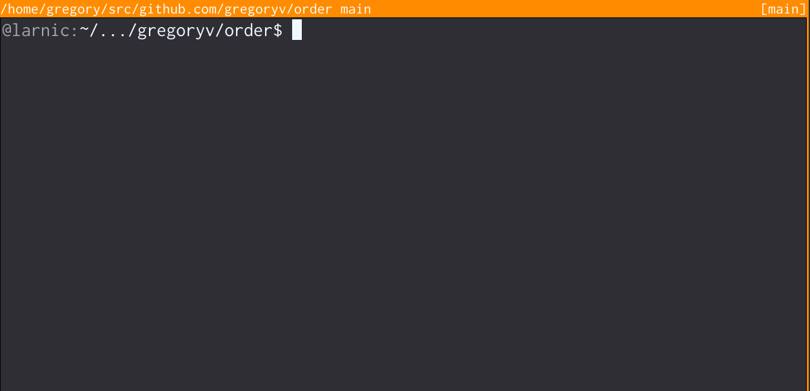

Package [order](https://pkg.go.dev/github.com/gregoryv/order) provides custom sorting of lines.

Initial purpose is to sort project directories and its
files in a more logic manner. Ie. a directory structure is
basically a tree but when designing a project we look at it in
terms of layers and concepts.

## Quick start

    $ go install github.com/gregoryv/order/cmd/order@latest
    $ order --help

## Example

    lines := []string{
        "bypattern.go",
        "bypattern_test.go",
        "changelog.md",
        "cmd",
        "go.mod",
        "go.sum",
        "LICENSE",
        "README.md",
    }
    patterns := []string{
        "README",
        "LICENSE",
        `\.md`,
        `go\.[mod|sum]`,
        "cmd",
    }
    sort.Sort(order.LinesByPattern(lines, patterns))
    for _, line := range lines {
        fmt.Println(line)
    }
    // output:
    // README.md
    // LICENSE
    // changelog.md
    // go.mod
    // go.sum
    // cmd
    // bypattern.go
    // bypattern_test.go
